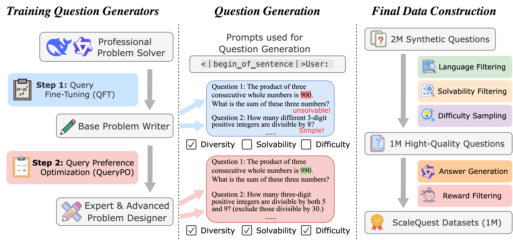
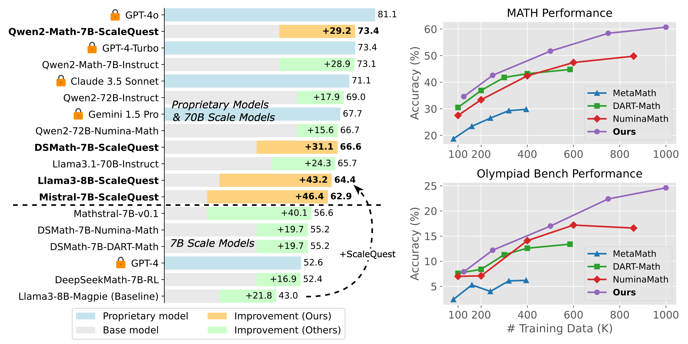

# ScaleQuest

This repository contains our complete data synthesis method, including:

1. Training a question generator through question fine-tuning (code in the `qft_train` folder).
2. Constructing preference data (code in the `question_optim` folder) and performing question preference optimization (code in the `qpo_train` folder).
3. Using the trained question generator to synthesize questions (code in the `data_generation` folder).
4. Applying a filtering process to the generated questions (code in the `question_filtering` folder).
5. Generating responses (code in the `data_generation` folder) and applying a reward filtering strategy (code in the `reward_filtering` folder).
6. For instruction-tuning and evaluation, we directly use the DART-Math framework.

We randomly sampled 100 generated data points and placed them in `data_samples/samples.jsonl`

## Method Overview

## Model Performance

